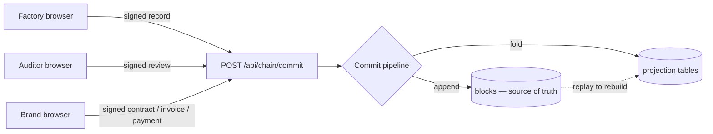
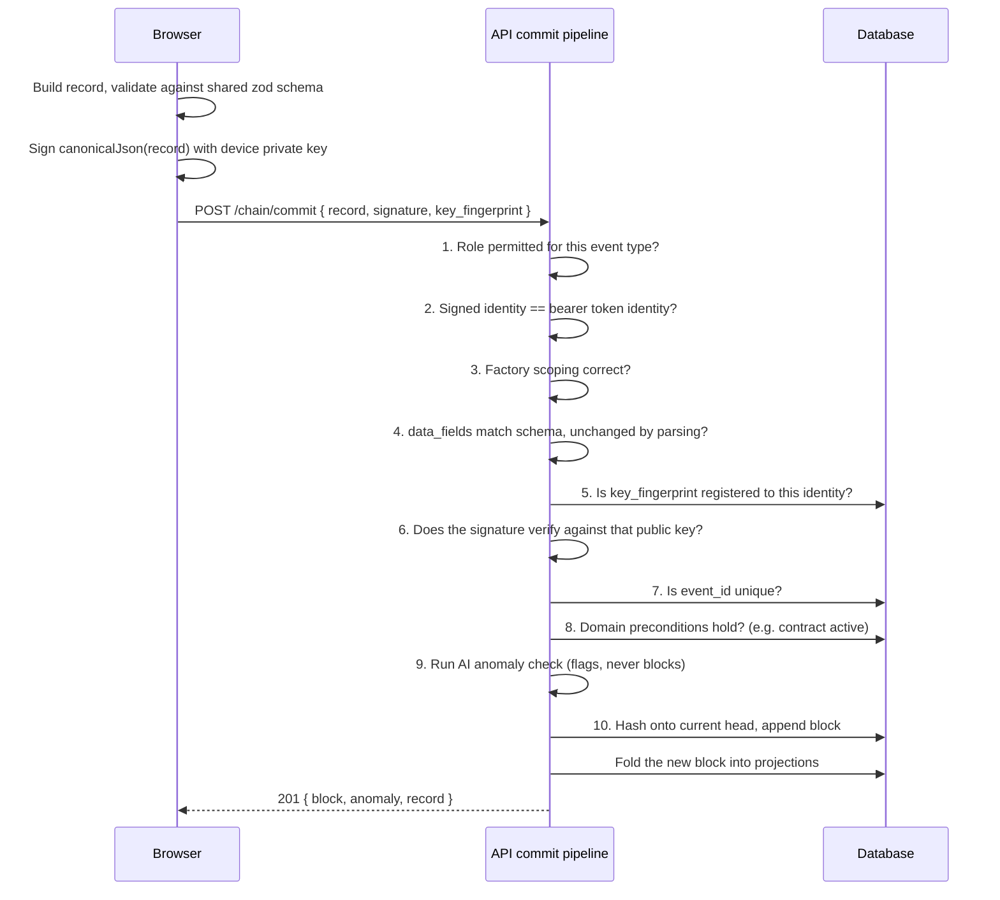

# Breadcrumbs — System Documentation

**A private, permissioned hash-chain for garment supply-chain compliance and commerce.**

This document describes what the system is, how it is built, how data moves through it, and why
each major decision was made. It is written as a single technical reference — not a getting-started
guide (see [`README.md`](README.md) for that) and not a full IEEE-style SRS, but everything a
reader would need to understand the system without reading the source.

---

## Table of contents

1. [System overview](#1-system-overview)
2. [Actors and roles](#2-actors-and-roles)
3. [Architecture](#3-architecture)
4. [Technology stack](#4-technology-stack)
5. [Data model](#5-data-model)
6. [Core trust mechanisms](#6-core-trust-mechanisms)
7. [AI anomaly detection layer](#7-ai-anomaly-detection-layer)
8. [System workflow](#8-system-workflow)
9. [API reference](#9-api-reference)
10. [Database schema](#10-database-schema)
11. [Frontend architecture](#11-frontend-architecture)
12. [Security model](#12-security-model)
13. [Testing](#13-testing)
14. [Deployment](#14-deployment)
15. [Known limitations and assumptions](#15-known-limitations-and-assumptions)

---

## 1. System overview

Breadcrumbs is a **custom-built, permissioned blockchain** — not Ethereum, not Hyperledger, no
mining, no gas fees, no smart-contract runtime. It is a hash-chain built from three primitives
(hashing, signing, linking) and applied to a real problem: garment factory compliance and the
commercial activity around it.

### The problem it answers

A brand buying from a factory needs to trust records it did not produce: was this inspection real,
was this invoice honest, was this chemical disposed of properly? Paper trails and spreadsheets can
be edited after the fact with no trace. Breadcrumbs makes editing history **detectable and
provable**, not merely against policy.

### The question the interface always answers

Every screen is built to answer three questions about any record on the ledger:

> **Who submitted this? Has it been altered? Did a person review it?**

### The two rules everything follows from

1. **The chain is append-only.** No code path updates or deletes a committed block, except one
   deliberately dangerous demo endpoint that exists precisely so tampering can be caught on camera
   (`POST /api/admin/tamper` — see [§6.5](#65-the-tamper-demonstration)).
2. **All derived state is a fold over the chain.** Stock levels, invoice balances, contract status
   and record status are never stored as independently-editable numbers — they are computed by
   replaying ledger events. `POST /api/admin/rebuild` drops every derived table and recomputes it
   from the blocks alone, which is the system proving its own claim.

### Scope

The system covers six domains on one chain: **audit records** (inspections, production,
certification, shipment), **inventory** (materials and chemicals), **contracts**, **invoices**,
**payments**, and **governance** (auditor review outcomes). There is exactly **one write path**
into all six — `POST /api/chain/commit` — so the permission and verification logic applies
uniformly regardless of which domain a record belongs to.

---

## 2. Actors and roles

Three roles, each scoped to a specific slice of the event taxonomy. A role is not just a UI
filter — the server rejects any commit whose event type is outside the caller's role
(`403 forbidden_event_type`), enforced in `apps/api/src/chain/ledger.ts`.

| Role | Represents | May submit | May not submit |
|---|---|---|---|
| **Factory** | The manufacturing site | Audit records, inventory movements, contract counter-signature, invoices | Payments, contract creation/amendment/closure, review decisions |
| **Auditor** | Independent compliance reviewer | Review confirmed / review disputed — nothing else | Everything else. An auditor cannot originate a record, only rule on one already flagged |
| **Brand / Buyer** | The purchaser | Contract creation, both-party signature, invoice approval/dispute/settlement, payments | Audit records, inventory movements |

### Permission matrix (event type → role)

| Event family | Factory | Auditor | Brand |
|---|:---:|:---:|:---:|
| Audit (inspection, production, certification, shipment) | ✅ submit | — | — |
| Inventory (materials, chemicals) | ✅ submit | — | — |
| Contract created / amended / closed | — | — | ✅ |
| Contract signed | ✅ counter-sign | — | ✅ initiate |
| Invoice issued | ✅ | — | — |
| Invoice approved / disputed / settled | — | — | ✅ |
| Payment initiated / settled / failed | — | — | ✅ |
| Review confirmed / disputed | — | ✅ | — |
| Genesis | — | — | — *(system-only, unreachable via the commit endpoint)* |

Twelve event types are submittable by factories, ten by brands (`contract_signed` is shared between
factory and brand, since a contract needs both signatures), two by auditors, and one
(`genesis`) by neither — it is written once, directly, when the ledger is created.

---

## 3. Architecture

### 3.1 Repository layout

An npm-workspaces monorepo with three packages. `packages/shared` is imported by **both** the
frontend and the backend — this is the load-bearing architectural decision described below.

```
Breadcrumbs new/
├─ packages/shared/       Isomorphic core — types, chain logic, AI rules, validation schemas
│  └─ src/
│     ├─ types/           roles.ts · ledger.ts · domain.ts
│     ├─ chain/           canonical.ts · crypto.ts · block.ts · verify.ts
│     ├─ ai/              anomaly.ts
│     └─ schemas/         events.ts (zod, one schema per event type)
│
├─ apps/api/              Hono server — the chain lives here
│  └─ src/
│     ├─ db/              schema.ts (Drizzle) · client.ts · migrate.ts · seed.ts · reset.ts
│     ├─ chain/           ledger.ts (commit pipeline) · projections.ts (the fold) · queries.ts · rows.ts
│     ├─ routes/          auth · chain · records · commerce · publicRoutes · admin
│     └─ middleware/      auth.ts (JWT) · error.ts
│  └─ test/                57 tests across 4 files
│
└─ apps/web/              React 19 SPA
   └─ src/
      ├─ lib/              api.ts (client) · signer.ts (sign+commit) · keystore.ts (IndexedDB keys) · format.ts
      ├─ store/            session.ts (zustand)
      ├─ components/       layout/ · ledger/ · ui/
      └─ pages/            20 page components across 21 routes
```

### 3.2 Why `packages/shared` is the architectural spine

`crypto.subtle` (SHA-256, ECDSA) exists identically in Node.js 20+ and in every modern browser.
Because of that, the canonical-JSON serialiser, the hashing functions, the signing/verification
functions, and the block-construction logic are written **exactly once** and imported unchanged by
both the API and the web app. There is no "server hashing implementation" and a separate "client
hashing implementation" that could quietly drift apart — they are the same module. This is what
makes the browser's signature and the server's verification of it mathematically guaranteed to
agree, rather than merely tested to agree.

The same package also holds the **zod validation schema** for every event type
(`schemas/events.ts`). The browser form validates against it before signing; the API validates the
request against the identical schema before verifying the signature. A record cannot reach the
chain in a shape the UI could not have produced.

### 3.3 The single write path



Every domain — audit, inventory, contracts, invoices, payments, governance — travels through the
same pipeline. There is no secondary API that writes directly to a projection table; a projection
row only ever exists because a block that implies it was committed and folded.

### 3.4 Read model vs. source of truth

| Layer | What it is | Mutable? |
|---|---|---|
| `blocks` table | The chain itself — every committed block, in order | **No.** Append-only. The one exception is the demo tamper endpoint, whose entire purpose is to be caught by verification. |
| `p_records`, `p_contracts`, `p_invoices`, `p_payments`, `p_inventory_balances` | Projections folded from `blocks` | Written only by `applyBlock()`, and only as a consequence of a new block. Never edited directly. |
| `identities`, `device_keys`, `factories`, `inventory_items` | Reference data | Seeded once; not part of the chain (there is no compliance claim being made about *who exists*, only about *what they did*). |

---

## 4. Technology stack

Every version below is pinned exactly (no `^` ranges) and was checked against Node 20.19.5 —
several packages have newer majors that require Node ≥ 22 and were deliberately held back.

### 4.1 Shared package

| Tool | Version | Purpose |
|---|---|---|
| TypeScript | 7.0.2 | Native compiler; strict mode, `noUncheckedIndexedAccess` |
| Zod | 4.5.4 | Runtime schema validation, shared between client and server |

### 4.2 Backend (`apps/api`)

| Tool | Version | Purpose |
|---|---|---|
| Hono | 4.13.5 | HTTP framework — routing, middleware, error handling |
| @hono/node-server | 2.1.1 | Node.js adapter for Hono |
| Drizzle ORM | 0.45.2 | Typed SQL schema and query builder |
| @libsql/client | 0.18.0 | SQLite driver (chosen over `better-sqlite3` — no native compiler needed, ships prebuilt binaries) |
| jose | 6.2.10 | JWT signing and verification |
| tsx | 4.23.13 | Runs TypeScript directly in Node, no build step |
| Vitest | 4.1.11 | Test runner |

### 4.3 Frontend (`apps/web`)

| Tool | Version | Purpose |
|---|---|---|
| React | 19.2.8 | UI library — Actions, `useActionState`, `useOptimistic` |
| Vite | 8.2.2 | Build tool and dev server (Rolldown-based) |
| @vitejs/plugin-react | 6.1.1 | React Fast Refresh for Vite |
| React Router | 7.18.3 | Routing, including the View Transitions `viewTransition` prop |
| TanStack Query | 5.102.8 | Server state — caching, invalidation, refetching |
| Zustand | 5.0.15 | Client state — session identity and device-key handle only |
| Tailwind CSS | 4.3.3 | CSS-first `@theme` design tokens |
| @tailwindcss/vite | 4.3.3 | Tailwind's Vite plugin |
| Lucide React | 1.40.0 | Icon set |
| Fontsource (Inter, Lora, IBM Plex Mono) | 5.3.0 | Self-hosted variable fonts — no external font CDN |

### 4.4 Cross-cutting

| Tool | Version | Purpose |
|---|---|---|
| Web Crypto API (`crypto.subtle`) | native | SHA-256 hashing, ECDSA P-256 signing/verification — identical in Node and browser |
| npm workspaces | — | Monorepo dependency and script management |
| concurrently | 9.2.4 | Runs the API and web dev servers together under `npm run dev` |
| Docker / docker-compose | — | Optional production packaging (nginx + API container) |

**Explicitly not used:** no animation library (CSS transitions + the native View Transitions API
instead), no ORM-generated migrations tool beyond Drizzle's schema definitions (DDL is plain,
idempotent `CREATE TABLE IF NOT EXISTS`), no external font or icon CDN, no existing blockchain
SDK or framework.

---

## 5. Data model

### 5.1 Event taxonomy — one chain, six families, 24 event types

| Family | Event types |
|---|---|
| `audit` | `inspection` · `production_report` · `certification` · `shipment` |
| `inventory` | `material_receipt` · `material_issue` · `chemical_receipt` · `chemical_consumption` · `stock_adjustment` · `chemical_disposal` |
| `contract` | `contract_created` · `contract_signed` · `contract_amended` · `contract_closed` |
| `invoice` | `invoice_issued` · `invoice_approved` · `invoice_disputed` · `invoice_settled` |
| `payment` | `payment_initiated` · `payment_settled` · `payment_failed` |
| `governance` | `review_confirmed` · `review_disputed` |
| `system` | `genesis` (unreachable via the API — written once at ledger creation) |

`data_fields` is a discriminated shape validated by a dedicated zod schema per event type, defined
once in `packages/shared/src/schemas/events.ts` and reused by both the submit form and the API.

### 5.2 Core chain types (`packages/shared/src/types/ledger.ts`)

```ts
interface SignedRecord {          // exactly what the client signs
  event_id: string;
  factory_id: string;
  event_type: EventType;
  timestamp: string;              // ISO-8601, asserted by the submitter
  submitter_id: string;
  submitter_name: string;
  submitter_role: SubmitterRole;  // 'factory' | 'auditor' | 'brand' | 'system'
  data_fields: Record<string, unknown>;
  ref_id: string | null;          // the contract/invoice/event this acts on
}

interface Block {                 // a committed, append-only entry
  index: number;
  timestamp: string;              // set by the server at commit time
  previous_block_hash: string;
  block_hash: string;
  record: SignedRecord;
  submitter_public_key: JsonWebKey | null;   // null only for genesis
  signature: string | null;                  // base64url ECDSA — null only for genesis
  ai_flag: boolean;
  ai_score: number | null;
  ai_flag_reason: string | null;
  ai_rule: string | null;
}

type ReviewStatus  = 'none' | 'confirmed' | 'disputed';
type RecordStatus  = 'pending' | 'verified' | 'flagged' | 'disputed';

interface LedgerRecord {          // the flattened read model every page renders
  event_id: string; factory_id: string; factory_name: string;
  event_type: EventType; event_family: EventFamily; timestamp: string;
  submitter_id: string; submitter_name: string; submitter_role: SubmitterRole;
  data_fields: Record<string, unknown>; ref_id: string | null;
  ai_flag: boolean; ai_flag_reason: string | null; ai_score: number | null; ai_rule: string | null;
  human_review_status: ReviewStatus; reviewer_name: string | null;
  reviewed_at: string | null; review_note: string | null;
  block_index: number; block_hash: string; previous_block_hash: string; signature: string | null;
  status: RecordStatus;           // derived — see deriveStatus() below, never stored
}

interface ChainReport {           // the output of verifying the whole chain
  ok: boolean; checkedAt: string; height: number;
  blocks: BlockCheck[]; firstBreakIndex: number | null; brokenCount: number;
}

interface BlockCheck {
  index: number; block_hash: string;
  hashValid: boolean; linkValid: boolean; signatureValid: boolean;
  invalidatedByEarlierBreak: boolean;   // the cascade
}
```

**Status is derived, once, in one function** (`deriveStatus()`), so no page or query can compute it
differently from another:

| Condition | Status | Badge |
|---|---|---|
| A `review_confirmed` event exists for this record | `verified` | teal, check |
| A `review_disputed` event exists for this record | `disputed` | navy outline, slash |
| `ai_flag` is true and no review exists | `flagged` | clay, triangle |
| No flag, no review | `pending` | gold, clock |

### 5.3 Domain types (`packages/shared/src/types/domain.ts`)

| Type | Purpose |
|---|---|
| `Identity` | A person: id, name, role, org, factory affiliation |
| `DeviceKey` | A registered public key: identity, JWK, fingerprint, label |
| `Factory` | id, name, location, certifications, employee count |
| `InventoryItem` / `InventoryBalance` / `InventoryItemView` | An item's identity (SKU, unit, hazard class, CAS number, MRSL flag) vs. its folded balance |
| `Contract` / `ContractSignature` / `ContractAmendment` | Agreement terms, the signature list, the amendment history |
| `Invoice` / `InvoiceLineItem` | Billing document with folded `paid_minor` / `pending_minor` / `balance_minor` |
| `Payment` | A money movement — `initiated`, `settled`, or `failed` |
| `FactoryTrust` | Verified/pending/flagged/disputed counts and a derived 0–100 score |

Money is stored as **integer minor units** (cents/paisa) throughout — never floating point —
because a ledger that cannot add up its own totals exactly is worse than no ledger.

---

## 6. Core trust mechanisms

All of this lives in `packages/shared/src/chain/` and runs identically on both sides.

### 6.1 Canonicalisation (`canonical.ts`)

`JSON.stringify` does not guarantee key order, so the same logical record could serialise
differently depending on how it was rebuilt — and then hash differently for no real reason.
`canonicalJson()` recursively sorts object keys before serialising (arrays keep their order, since
order there is meaningful). **Nothing in the codebase calls `JSON.stringify` on data that is going
to be hashed or signed** — everything goes through this one function.

### 6.2 Hashing (`crypto.ts`)

SHA-256 via `crypto.subtle.digest`. Two properties this gives the system:

- The same input always produces the same 64-character hex fingerprint.
- Changing a single byte of input — `500` becoming `5000` — produces a completely different,
  unrecognisable fingerprint (the avalanche effect, asserted directly in `chain.test.ts`).

### 6.3 Signing (`crypto.ts`)

ECDSA on the P-256 curve. The browser generates the keypair with `extractable: false`, meaning the
**private key has no exportable form** — it cannot be serialised, logged, or transmitted by any
code, including this application's own. Only the public JWK half is ever registered with the
server. The signature covers `canonicalJson(record)` — the submitter's claim only, never the AI
verdict, since the submitter cannot know that before it exists.

### 6.4 Chaining and the block hash (`block.ts`)

The block hash is SHA-256 over the canonical JSON of:

```
{ index, timestamp, previous_block_hash, record,
  submitter_public_key, signature, ai_flag, ai_score, ai_flag_reason, ai_rule }
```

Including the AI verdict in the hash — not just the record — means a flag cannot be quietly erased
later without changing the hash and breaking the chain. The genesis block (`index: 0`) has
`previous_block_hash` fixed to 64 zero characters, no signature, and an event type (`genesis`) that
no role is permitted to submit — so a second genesis can never be forged through the API.

### 6.5 Verification (`verify.ts`)

`verifyChain()` walks the chain in order and, for every block, checks three independent things:

1. **`hashValid`** — recomputing the block's hash from its stored contents matches the stored hash.
2. **`linkValid`** — the block's `previous_block_hash` equals the previous block's stored hash.
3. **`signatureValid`** — the ECDSA signature verifies against the submitter's registered public key.

The moment any block fails, **every later block is marked `invalidatedByEarlierBreak`**, even if
its own hash and signature still check out — because the history it is anchored to no longer holds.
This is the literal mechanism behind the ledger's central claim: editing an old record doesn't just
corrupt that one row, it invalidates everything written after it.

### 6.6 The tamper demonstration

`POST /api/admin/tamper` is the one function in the entire codebase that mutates a committed block:
it rewrites a field inside `data_fields` and **deliberately leaves the stored hash untouched** —
exactly what an attacker with database access would attempt. Running `verify` afterwards then
genuinely fails at that block, cascades through everything after it, and — because balances are
folded from the chain rather than stored — the affected stock level or invoice total visibly shifts
too. `POST /api/admin/restore` wipes and re-seeds a clean ledger.

---

## 7. AI anomaly detection layer

Deliberately small — one file, seven pure functions, roughly 5% of the codebase — reflecting the
brief's own instruction that this layer stay a lightweight supporting check, not the system's core.
It runs **server-side**, inside the commit pipeline, after signature verification and before the
block is hashed. **A flag never blocks a commit** — a flagged record is still written to the chain
and routed to an auditor, because silently rejecting a record would defeat the point of an
immutable ledger.

| Rule | Triggers on | Catches |
|---|---|---|
| `production_volume_zscore` | `production_report` | Output more than 2.5σ from this factory's own history |
| `working_hours_zscore` | `production_report`, `inspection` | Labour-hours anomaly, same method |
| `chemical_mass_balance` | `chemical_consumption` | Chemical use per unit of output off this factory's norm — undeclared production or undeclared chemical use |
| `invoice_exceeds_contract` | `invoice_issued` | Cumulative billing exceeding 105% of the contract's agreed value |
| `duplicate_invoice` | `invoice_issued` | Same amount from the same factory within 3 days |
| `payment_mismatch` | `payment_initiated`, `payment_settled` | Payment exceeding the invoice's remaining headroom; a settlement that doesn't match what was initiated; money against an already-settled invoice |
| `negative_stock` | `material_issue`, `chemical_consumption`, `chemical_disposal` | A movement larger than the derived on-hand stock — a physical impossibility |

Constants: `MIN_HISTORY = 3` prior records before a statistical baseline is trusted (fewer than
that returns an explicit *"insufficient history"* note rather than a silent pass);
`Z_THRESHOLD = 2.5`; `CONTRACT_TOLERANCE = 1.05`; `DUPLICATE_WINDOW_DAYS = 3`.

Each factory's history is scoped to **that factory only** — one factory's normal volume can never
mask another factory's spike, because the z-score baseline is built exclusively from the submitting
factory's own prior records.

---

## 8. System workflow

### 8.1 The commit pipeline

Every write — regardless of domain — passes through the same ten checks, in this order, inside
`apps/api/src/chain/ledger.ts`:



Steps 1–3 enforce **who may write what** (permissioning). Steps 5–6 enforce **non-repudiation** —
the server holds no private keys, so it can verify a signature but never produce one; a forged
signature or a record altered after signing is rejected with `401 bad_signature` and nothing is
written. Step 4 is subtle: the signature covers the *exact bytes submitted*, so if schema parsing
would change the value (e.g. applying a default for an omitted field), the server refuses rather
than silently storing something the signature no longer covers.

### 8.2 Review workflow

```
Factory submits record → AI check runs inline → flagged?
                                                    │
                                    ┌── no ─────────┤── yes ──┐
                                    ▼                         ▼
                              status: pending          appears in auditor's
                                                         review queue
                                                                │
                                                    auditor confirms or disputes
                                                                │
                                                   new governance block committed
                                                    (original record unchanged)
                                                                │
                                              status updates everywhere the record
                                              is shown: dashboard, explorer, public
                                              lookup, record detail — simultaneously
```

Confirming or disputing is itself a signed chain event (`review_confirmed` / `review_disputed`),
not a status update on the original row. This is what makes "records are never deleted, only
reviewed" a structural guarantee rather than a policy.

### 8.3 Commercial workflow (contract → invoice → payment)

```
Brand creates contract (contract_created) ── brand signs (contract_signed)
                                                         │
                                        factory counter-signs (contract_signed)
                                                         │
                                          BOTH signatures present → status: active
                                                         │
                                      factory issues invoice (invoice_issued)
                                        [rejected 422 if contract not active]
                                                         │
                              brand approves / disputes (invoice_approved / invoice_disputed)
                                                         │
                                   brand initiates payment (payment_initiated)
                                                         │
                                   brand settles payment (payment_settled)
                                                         │
                     invoice balance, contract "invoiced" total, and payment history
                          all update because they are folded from these events
```

A contract does not become active because a status field changed — it becomes active because two
independently-verifiable signatures, from two different keys, exist on the chain.

### 8.4 Inventory workflow

```
Receipt (material_receipt / chemical_receipt)  →  increases on-hand
Issue / consumption / disposal                  →  decreases on-hand
                                                    [rejected → flagged if it would go negative]
Stock adjustment (signed, either direction)     →  correction

on_hand = received − issued − consumed − disposed + adjusted
```

This value is never stored as an editable column — it is recomputed from `p_inventory_balances`,
which is itself folded from every inventory block for that SKU.

---

## 9. API reference

Base path: `/api`. Reads are public where the brief requires transparency (chain, explorer, public
lookup); writes require a bearer JWT. The only endpoint that mutates ledger state is `POST
/chain/commit` — every other `POST` under `/admin` is an explicitly demo-only control.

| Method | Path | Auth | Purpose |
|---|---|---|---|
| GET | `/health` | — | Liveness + chain height |
| GET | `/factories` | — | All factories with folded trust scores |
| GET | `/auth/identities` | — | The sign-in directory (mocked auth) |
| POST | `/auth/login` | — | Issues a JWT for a chosen identity |
| POST | `/auth/register-key` | ✅ | Registers a browser-generated public key |
| GET | `/auth/me` | ✅ | Current identity + registered keys |
| GET | `/chain/head` | — | Latest block + height |
| GET | `/chain/blocks` | — | All blocks, filterable by family/factory |
| GET | `/chain/blocks/:index` | — | One block by position |
| GET | `/chain/verify` | — | Full-chain verification report |
| POST | `/chain/commit` | ✅ | **The only write path into the ledger** |
| GET | `/records` | — | Ledger records, filterable |
| GET | `/records/flagged` | — | The auditor review queue |
| GET | `/records/:eventId` | — | One record, fully hydrated |
| GET | `/inventory/materials` \| `/chemicals` \| `/items` | — | Folded stock views |
| GET | `/inventory/:factoryId/:sku` | — | One item + its movement ledger |
| GET | `/contracts` \| `/contracts/:id` | — | Contracts, with signatures and invoices |
| GET | `/invoices` \| `/invoices/:id` | — | Invoices, with payments and events |
| GET | `/payments` \| `/payments/:id` | — | Payments, with the invoice they settle |
| GET | `/transactions` | — | Unified cross-domain feed, searchable |
| GET | `/public/factories` \| `/public/factories/:id` | — | Buyer-facing plain-language timeline |
| GET | `/public/verify/:eventId` | — | Target of a "copy verification link" |
| POST | `/admin/tamper` | — | **Demo only** — corrupts a block's data without recomputing its hash |
| POST | `/admin/restore` | — | **Demo only** — wipes and reseeds a clean ledger |
| POST | `/admin/rebuild` | — | **Demo only** — recomputes every projection from the chain alone |

The `/admin` group can be switched off entirely with `BREADCRUMBS_ADMIN_TOOLS=false`.

---

## 10. Database schema

SQLite via libsql. Ten tables, split cleanly into source of truth, reference data, and derived
projections (see [§3.4](#34-read-model-vs-source-of-truth)).

| Table | Kind | Holds |
|---|---|---|
| `blocks` | Source of truth | Every committed block — hash, previous hash, signature, record JSON, AI verdict |
| `identities` | Reference | The people who can sign in |
| `device_keys` | Reference | Registered public keys, one row per browser per identity |
| `factories` | Reference | Factory profile — location, certifications, employee count |
| `inventory_items` | Reference | SKU catalogue — unit, hazard class, CAS number, MRSL flag |
| `p_records` | Projection | Review status + derived `status` per event, for fast filtering |
| `p_contracts` | Projection | Folded status, signatures (JSON), amendments (JSON), invoiced-to-date |
| `p_invoices` | Projection | Folded totals, paid, pending, balance, status |
| `p_payments` | Projection | Folded status, settlement timestamp |
| `p_inventory_balances` | Projection | Folded on-hand quantity per factory + SKU |

`blocks` carries denormalised columns (`event_type`, `event_family`, `factory_id`, `submitter_id`,
`ref_id`) purely so the explorer and transaction feed can filter in SQL — the `record_json` column
remains the single authoritative source for anything that gets re-hashed or re-verified.

---

## 11. Frontend architecture

### 11.1 State management split

| State | Owner | Why |
|---|---|---|
| Server state (chain, records, balances, contracts…) | **TanStack Query** | Query-key invalidation means a single review decision updates the dashboard, explorer, transaction feed and public lookup simultaneously, without manual cache plumbing |
| Session (identity, JWT) | **Zustand** | Small, synchronous, persisted to `localStorage` |
| Device signing key | **Zustand handle → IndexedDB** | The `CryptoKey` object itself is stored in IndexedDB (non-extractable keys survive structured cloning); Zustand just holds a reference to it |
| UI-only state (form drafts, filters) | Local component state | No reason to lift it further |

### 11.2 Routing (React Router 7)

| Route | Page | Access |
|---|---|---|
| `/` | Landing | Public |
| `/login` | Role and identity selection | Public |
| `/explorer` | Blockchain explorer, verify button, Integrity Lab | **Public** |
| `/record/:eventId` | Canonical record detail — every status badge everywhere links here | **Public** |
| `/lookup`, `/lookup/:factoryId` | Buyer-facing search and plain-language timeline | **Public** |
| `/app` | Role-aware dashboard (three variants) | Signed in |
| `/app/transactions` | Unified cross-domain feed | Signed in |
| `/app/submit` | Audit record submission, with the live sign→hash→commit sequence | Factory |
| `/app/review` | Flagged-only review queue | Auditor |
| `/app/inventory/:kind`, `/app/inventory/:factoryId/:sku` | Materials/chemicals list and item detail | Signed in |
| `/app/contracts`, `/new`, `/:contractId` | List, creation, multi-party signature panel | Signed in / Brand |
| `/app/invoices`, `/new`, `/:invoiceId` | List, creation, approve/dispute/pay actions | Signed in / Factory / Brand |
| `/app/payments`, `/:paymentId` | List, detail | Signed in |

Explorer, record detail and public lookup are deliberately **not** gated — a copied verification
link has to open for someone with no account, and transparency is a stated feature, not a paid
tier.

### 11.3 Design system

Tailwind v4 `@theme` tokens, matching the brief's palette exactly:

| Token | Value | Meaning |
|---|---|---|
| `--color-navy` | `#0F2540` | Primary |
| `--color-parchment` | `#F7F5EF` | Background |
| `--color-gold` | `#C9A24B` | Trust / verified cues |
| `--color-teal` | `#1D6E63` | Success / verified state |
| `--color-clay` | `#B23A2E` | **Reserved exclusively** for flagged / tampered states |
| `--font-display` | Lora | Headings |
| `--font-sans` | Inter | Body / UI |
| `--font-mono` | IBM Plex Mono | Hashes, signatures, technical values |

Enforced rules: status is always colour **and** icon **and** text label, never colour alone;
hashes and signatures are muted, monospace, and middle-truncated by default with detail opt-in; one
solid navy primary action per screen; a single light theme (no dark mode — the warm parchment
ground is what keeps this reading as a compliance dashboard rather than a crypto app).

---

## 12. Security model

| Concern | Mechanism |
|---|---|
| **Authentication** | Mocked (pick an identity, no password) by design — the brief allows this. Issues a real `jose`-signed JWT. |
| **Authorization** | Enforced server-side on every commit via `canSubmit(role, eventType)` — not a UI-only restriction. |
| **Non-repudiation** | Private keys are generated in the browser with `extractable: false` and never leave the device. The server holds only public keys, so it can verify a signature but never forge one. |
| **Tamper evidence** | SHA-256 block hashing + previous-hash linking. Any alteration of stored data is caught by hash mismatch on the affected block, and cascades to every later block. |
| **Data integrity in transit to storage** | The commit pipeline refuses to store a `data_fields` value that differs from what schema validation would produce — the signature must cover exactly what ends up on disk. |
| **Least privilege** | A factory JWT scoped to `FAC-MEGHNA` cannot write records for `FAC-ASHULIA` (`403 wrong_factory`), independent of role permissions. |
| **Idempotency / replay** | `event_id` is unique across the chain (`409 duplicate_event` on collision). |

**Explicit limitation:** authentication itself is not hardened (no password, no MFA) — this is a
stated design choice for a demonstration system, not an oversight. See
[§15](#15-known-limitations-and-assumptions).

---

## 13. Testing

57 tests across 4 files in `apps/api/test/`, run via Vitest. Each test file builds its own
**in-memory** SQLite database (`file::memory:`) — fully isolated from the real ledger file and from
each other, and independent of whether the dev server is running.

| File | Covers |
|---|---|
| `chain.test.ts` | Canonicalisation determinism, hash avalanche effect, signature verification/rejection, the seeded chain verifying end-to-end, the tamper cascade, a re-pointed previous-hash being caught even when the block's own hash is intact |
| `ledger.test.ts` | Every permission boundary, non-repudiation (forged signatures, post-signing alteration, identity mismatch, unregistered/mismatched keys), schema validation, duplicate event rejection, append-only governance, domain preconditions (e.g. invoicing an unsigned contract) |
| `ai.test.ts` | All seven anomaly rules in isolation, including the insufficient-history case and the payment-settlement regression (settling a payment must not be judged against a balance that already excludes it) |
| `projections.test.ts` | Rebuild produces identical state to incremental folding; invoice/contract/payment reconciliation; inventory arithmetic; contract activation requiring both signatures; review outcomes reflected correctly |

Beyond the automated suite, the full browser-shaped flow (generate a non-extractable key → register
its public half → sign a record → commit over real HTTP → verify a forged signature is rejected →
verify the chain still checks out) was exercised against the live running server during
development.

---

## 14. Deployment

| Mode | Command | Characteristics |
|---|---|---|
| **Development** | `npm run dev` | Vite dev server (hot module reload) + `tsx watch` (restarts on change). What this system has been run and demonstrated with. |
| **Production (manual)** | `npm run build` then `npm run start -w @breadcrumbs/api` | Optimised, minified static bundle; API without the file-watcher. `apps/web/dist` needs serving by a static file server / reverse proxy. |
| **Production (Docker)** | `docker compose up --build` | `Dockerfile.api` (Node 20, `npm start`) + `Dockerfile.web` (multi-stage build → nginx serving the built bundle, `/api` proxied through). Ledger persisted in a named volume. Written and reviewed but not executed on the build machine (no Docker installed there). |

The API **auto-seeds** a 90-day, four-factory demo history (165 blocks, four independently-detected
anomalies) the first time it finds an empty ledger — controlled by `BREADCRUMBS_SEED_ON_EMPTY`
(default `true`). It never touches a ledger that already has blocks.

---

## 15. Known limitations and assumptions

- **Authentication is mocked.** Identity selection carries no credential check. Everything
  *downstream* of the issued token is fully enforced; the front door is not — a deliberate scope
  decision for a demonstration system, not a gap discovered late.
- **Single-writer ordering.** Block appends are serialised by an in-process async lock, correct for
  one API process. Horizontal scaling would need a database-level lock or a different append
  strategy.
- **Seed key custody.** The seeding script generates *extractable* keypairs so it can sign 90 days
  of historical fixtures on behalf of demo identities, then discards the private halves — only
  public keys persist. Signing in as a seeded identity in a real browser registers a fresh,
  properly non-extractable key for that session.
- **The tamper endpoint is real, not simulated.** `POST /api/admin/tamper` genuinely corrupts
  stored data. It exists to make verification demonstrably meaningful and can be disabled via
  `BREADCRUMBS_ADMIN_TOOLS=false`.
- **Compliance reference data is illustrative.** CAS numbers and MRSL restricted-substance flags on
  seeded chemicals are realistic but are demo fixtures, not a maintained regulatory dataset.
- **Docker path is unverified by execution.** Written and statically reviewed; not built or run,
  since Docker is not installed on the development machine.

---

*For setup instructions, demo scenarios, and day-to-day commands, see [`README.md`](README.md).*
